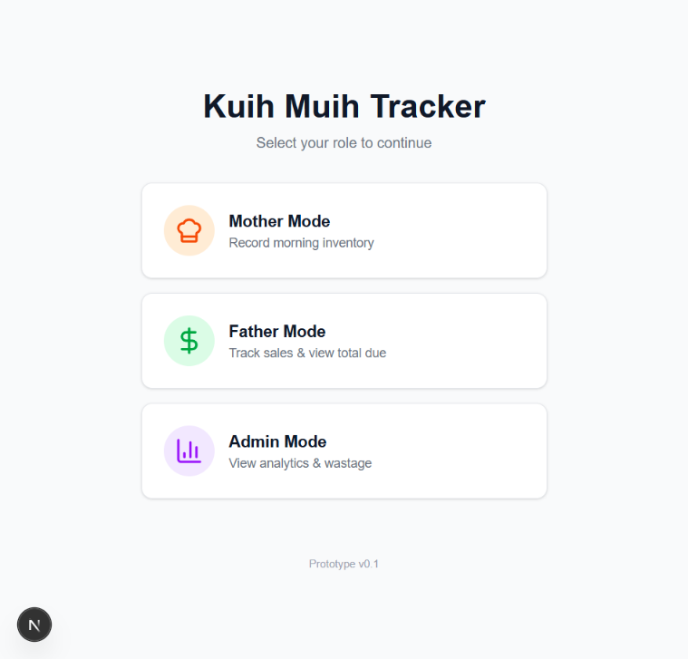
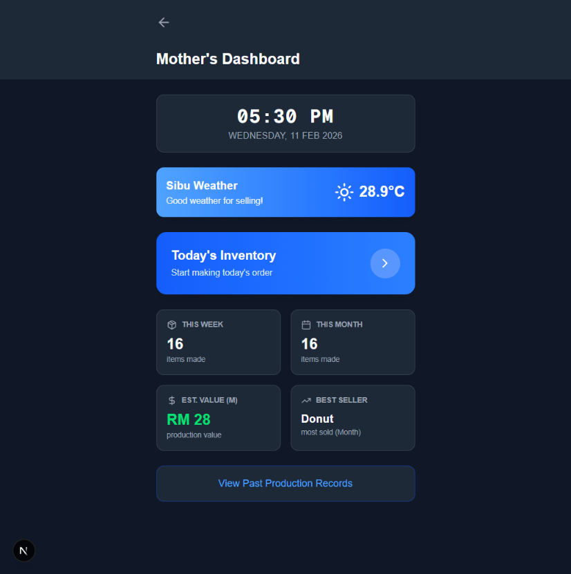
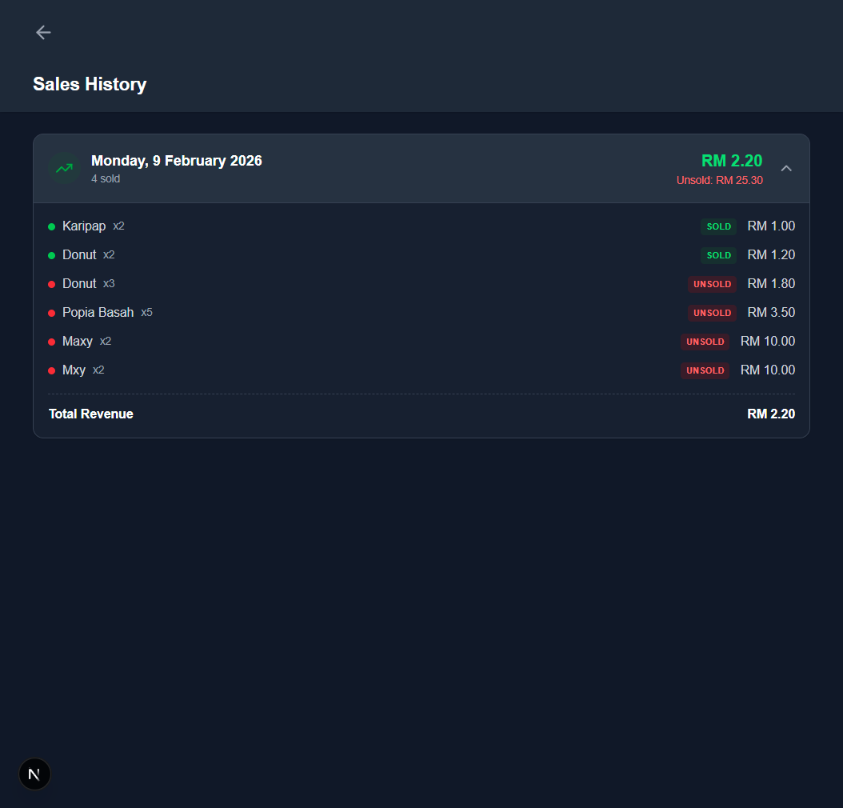
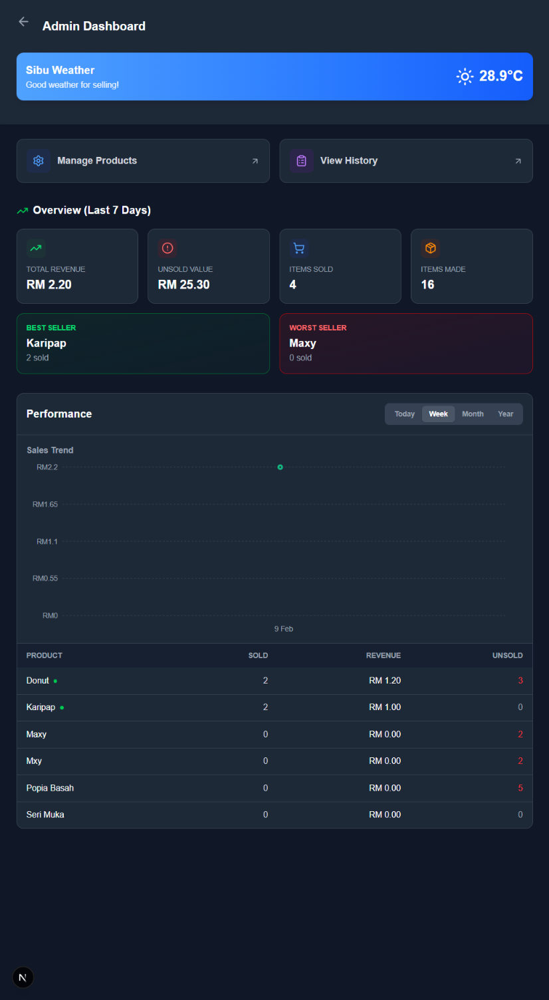
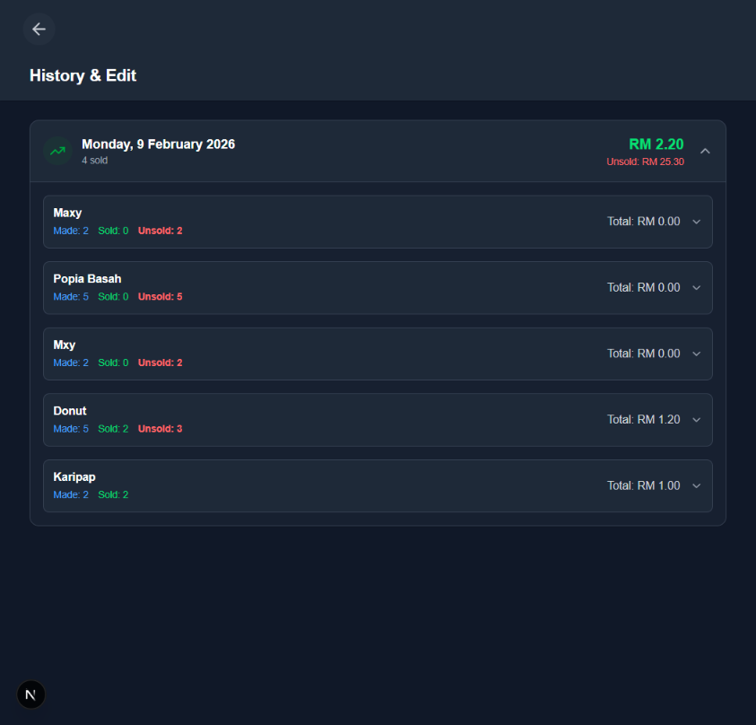

# 🍡 Kuih Muih Tracker

A modern, streamlined inventory and sales management system designed specifically for traditional kuih businesses. This application helps bridge the gap between production and sales, providing clear roles for inventory management and sales tracking.

## ✨ Showcase

### Application Preview
````carousel

<!-- slide -->

<!-- slide -->

<!-- slide -->

<!-- slide -->

````

## 🚀 Core Features

### 👩‍🍳 Mother Mode (Production/Inventory)
*   **Morning Inventory Recording**: Quickly log the quantities of each kuih type prepared for the day.
*   **Stock Management**: Real-time entry of starting stock.

### 👨‍💼 Father Mode (Sales/Tracking)
*   **Live Sales Updates**: Track kuih sales as they happen throughout the day.
*   **Settlement View**: Easily see total amounts due based on items sold.

### 📊 Admin Mode (Analytics)
*   **Performance Metrics**: View which kuih types are selling best.
*   **Wastage Analysis**: Track and reduce inventory loss with detailed wastage reports.
*   **Historical Trends**: Analyze sales over time to optimize production.

## 🛠️ Tech Stack

*   **Frontend**: [Next.js 16](https://nextjs.org/) (React 19)
*   **Styling**: [Tailwind CSS](https://tailwindcss.com/)
*   **Icons**: [Lucide React](https://lucide.dev/)
*   **Charts**: [Recharts](https://recharts.org/)
*   **Database**: [Supabase](https://supabase.com/)

## 🛠️ Getting Started

### Prerequisites

*   Node.js 18.x or later
*   npm or yarn

### Installation

1. Clone the repository:
   ```bash
   git clone <repository-url>
   cd kuih-muih
   ```

2. Install dependencies:
   ```bash
   npm install
   ```

3. Configure Environment Variables:
   Create a `.env.local` file in the root directory and add your Supabase credentials:
   ```env
   NEXT_PUBLIC_SUPABASE_URL=your-project-url
   NEXT_PUBLIC_SUPABASE_ANON_KEY=your-anon-key
   ```

4. Run the development server:
   ```bash
   npm run dev
   ```

Open [http://localhost:3000](http://localhost:3000) with your browser to see the result.

## 📄 License

This project is licensed under the MIT License.
